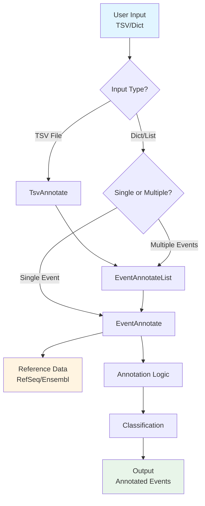
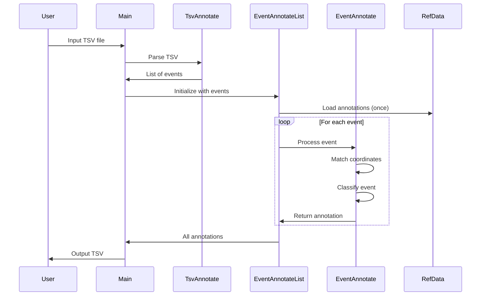
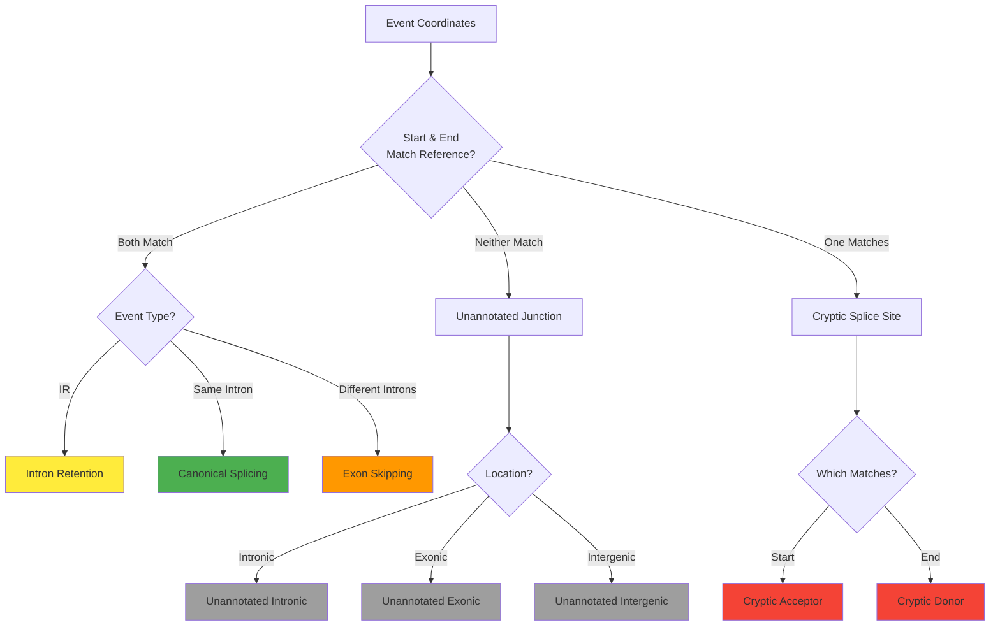
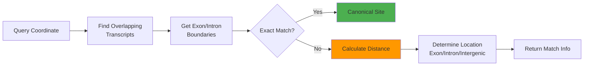

# Developer Guide - Splice Event Annotation Repository (SEAR)

## Table of Contents

1. [Project Overview](#project-overview)
2. [Architecture](#architecture)
3. [Core Modules](#core-modules)
4. [Data Flow](#data-flow)
5. [Development Setup](#development-setup)
6. [Testing](#testing)
7. [Contributing](#contributing)

## Project Overview

SEAR (Splice Event Annotation Repository) is a Python library designed to annotate splicing events using data from RefSeq and Ensembl databases. The library identifies and classifies various types of splicing events including:

- **Canonical splicing**: Normal exon-exon junctions
- **Exon skipping**: Events where one or more exons are excluded
- **Intron retention**: Events where introns are retained in the transcript
- **Cryptic splice sites**: Novel splice sites not in reference annotations
- **Alternative splicing**: Events that match alternative transcripts
- **Unannotated junctions**: Novel junctions not in reference data

### Key Features

- Annotation of splicing events using RefSeq databases
- Support for both single and batch event processing
- Classification of complex splicing patterns
- Distance calculations for cryptic splice sites
- MANE (Matched Annotation from NCBI and EBI) transcript identification
- Comprehensive event type categorization

### Technology Stack

- **Language**: Python 3.12+
- **Data Processing**: pandas, numpy
- **Validation**: pydantic
- **Testing**: pytest, pytest-bdd
- **Genomics**: pysam

## Architecture

SEAR follows a modular architecture with clear separation of concerns:



### Component Hierarchy

1. **Entry Points**
   - `main.py`: CLI interface and workflow orchestration
   - `run_workflow()`: Main processing function

2. **Input Processing**
   - `TsvAnnotate`: Handles TSV file parsing
   - `BedExpand`: Processes BED format files

3. **Annotation Processing**
   - `EventAnnotate`: Core single-event annotation logic
   - `EventAnnotateList`: Batch processing wrapper

4. **Reference Data**
   - GenePred format parsers
   - RefSeq/Ensembl database loaders

## Core Modules

### 1. main.py

**Purpose**: Entry point for the application, handles CLI arguments and workflow orchestration.

**Key Functions**:
- `main()`: CLI entry point
- `parse_args()`: Argument parsing and validation
- `run_workflow()`: Main processing workflow
- `write_output()`: Writes annotations to TSV

**Usage Example**:
```python
from splicing_event_annotator.main import run_workflow

# Single event
event = {
    'chrom': 'chr1',
    'start': 1000,
    'end': 2000,
    'strand': '+',
    'transcript': 'NM_001234.5',
    'type': 'sj'
}
annotations = run_workflow(event, dataset='refseq', genome='hg38')

# Batch processing
events = [event1, event2, event3]
annotations = run_workflow(events, dataset='refseq', genome='hg38')
```

### 2. eventAnnotateProcessor.py

**Purpose**: Core annotation logic for individual splicing events.

**Key Classes**:

#### SplicingCoordinates (Pydantic Model)
- Validates and stores event coordinates
- Fields: `chrom`, `start`, `end`, `strand`, `transcript`, `type`

#### AnnotationOutput (Pydantic Model)
- Structures the annotation results
- Fields: `event`, `event_type`, `introns`, `location`, `distance_from_authentic`, `transcript`

#### EventAnnotate (Main Processor)

**Key Methods**:

- `process()`: Main annotation workflow
  - Loads reference annotations
  - Matches event coordinates to reference
  - Classifies event type
  - Returns structured annotation

- `get_mane_transcript()`: Identifies MANE transcript for coordinates
  - Finds overlapping MANE transcripts
  - Handles strand matching
  - Returns transcript ID and gene name

- `reference_match()`: Matches event coordinates to reference
  - Finds overlapping transcripts
  - Determines exon/intron regions
  - Returns matching information

- `get_exon_intron()`: Determines genomic region type
  - Calculates exon/intron boundaries
  - Handles strand-specific numbering
  - Returns region information

- `fetch_transcript_annotations()`: Main classification logic
  - Checks for canonical/cryptic/unannotated events
  - Determines event type (IR, exon skipping, etc.)
  - Calculates distances for cryptic sites

**Private Methods (Classification)**:

- `_annotate_canonical()`: Canonical splice junction
- `_annotate_intron_retention()`: Intron retention events
- `_annotate_exon_skipping()`: Exon skipping events
- `_annotate_cryptic()`: Cryptic splice sites
- `_annotate_unannotated()`: Novel junctions
- `_annotate_supplementary()`: Complex multi-exon events
- `_is_alternate_splicing()`: Checks if event matches alternative transcripts
- `_produce_annotation()`: Formats final annotation output

**Static Methods**:

- `read_refgene()`: Loads RefSeq annotations
- `read_genepred()`: Parses GenePred format files

### 3. eventAnnotateProcessorList.py

**Purpose**: Batch processing wrapper for multiple events.

**Key Class**: EventAnnotateList

**Benefits**:
- Loads reference annotations once for all events
- Provides progress logging
- More efficient for large datasets

**Usage**:
```python
from splicing_event_annotator.eventAnnotateProcessorList import EventAnnotateList

events = [event1, event2, event3, ...]
processor = EventAnnotateList(events, dataset='refseq', genome='hg38')
annotations = processor.process()
```

### 4. tsvAnnotateProcessor.py

**Purpose**: Parses TSV input files into event dictionaries.

**Key Class**: TsvAnnotate

**Features**:
- Customizable column mapping
- Header row handling
- Type conversion (coordinates to integers)

**Expected TSV Format**:
```
chromosome  start    end      strand  event_type  transcript
chr1        1000     2000     +       sj          NM_001234.5
chr1        3000     4000     -       ir          NM_005678.3
```

### 5. bedExpandProcessor.py

**Purpose**: Processes BED format files for intron annotations.

**Key Class**: BedExpand

**Features**:
- Parses BED6 format
- Extracts transcript and intron information from name field
- Converts to standardized format

**Note**: This module is specialized for curated intron files.

## Data Flow

### Event Processing Flow



### Classification Decision Tree



### Reference Matching Process



## Development Setup

### Prerequisites

- Python 3.12 or higher
- pip (Python package manager)
- Git

### Installation

1. **Clone the repository**:
```bash
git clone https://github.com/frontier-genomics/splicing_event_annotations.git
cd splicing_event_annotations
```

2. **Install dependencies**:
```bash
pip install -r requirements.txt
pip install -r requirements-dev.txt
```

3. **Download reference data**:
```bash
# For hg38 genome
./download_refGene_hg38.sh

# For hg19 genome
./download_refGene_hg19.sh
```

### Project Structure

```
splicing_event_annotations/
├── splicing_event_annotator/     # Main package
│   ├── __init__.py
│   ├── main.py                   # CLI and workflow
│   ├── eventAnnotateProcessor.py # Core annotation logic
│   ├── eventAnnotateProcessorList.py  # Batch processing
│   ├── tsvAnnotateProcessor.py   # TSV parsing
│   ├── bedExpandProcessor.py     # BED parsing
│   └── reference/                # Reference annotations
│       ├── hg38/
│       └── hg19/
├── tests/                        # Test suite
│   ├── conftest.py              # Pytest configuration
│   ├── *.feature                # BDD feature files
│   └── test_*.py                # Test implementations
├── resources/                    # Test data and resources
├── docs/                        # Documentation
├── requirements.txt             # Production dependencies
├── requirements-dev.txt         # Development dependencies
├── run-tests.sh                # Test runner script
├── run-coverage.sh             # Coverage report script
└── README.md                   # User documentation
```

## Testing

### Test Structure

The project uses pytest with pytest-bdd for behavior-driven development:

- **Unit Tests**: Test individual functions and methods
- **Integration Tests**: Test complete workflows
- **BDD Tests**: Gherkin-style scenarios in `.feature` files

### Running Tests

```bash
# Run all tests
./run-tests.sh

# Run specific test file
pytest tests/test_eventAnnotate.py -v

# Run with coverage
./run-coverage.sh

# Run specific test scenario
pytest tests/test_eventAnnotate.py::test_canonical_splicing -v
```

### Test Categories

Tests are organized by module:

1. **test_eventAnnotate.py**: Core annotation logic
   - Canonical splicing
   - Exon skipping (single, double, triple)
   - Intron retention
   - Cryptic acceptors and donors
   - Complex events (skipping + cryptic)
   - Unannotated junctions
   - MANE transcript identification

2. **test_eventAnnotateList.py**: Batch processing

3. **test_tsveventAnnotate.py**: TSV parsing

4. **test_bedExpand.py**: BED file processing

5. **test_cli.py**: Command-line interface

### Writing Tests

Example test structure:
```python
@pytest.mark.parametrize("chrom,start,end,strand,event_type,transcript,expected_type,expected_event", [
    ("chr1", 1000, 2000, "+", "sj", "NM_001234.5", "canonical", "exon 1-2 splicing"),
])
def test_canonical_splicing(chrom, start, end, strand, event_type, transcript, expected_type, expected_event):
    processor = EventAnnotate(chrom, start, end, strand, transcript, event_type)
    result = processor.process('refseq', 'hg38')
    assert result['event_type'] == expected_type
    assert expected_event in result['event']
```

### Test Data

Test data is located in:
- `splicing_event_annotator/reference/hg38/`: Reference annotations for testing
- Test cases use real genes with known splicing patterns
- Genes are primarily from chromosome X to keep test files small

## Contributing

### Code Style

- Follow PEP 8 guidelines
- Use meaningful variable and function names
- Add docstrings to public functions and classes
- Keep functions focused and single-purpose

### Adding New Features

1. **Create a feature branch**:
```bash
git checkout -b feature/your-feature-name
```

2. **Implement the feature**:
   - Write tests first (TDD approach)
   - Implement the functionality
   - Ensure all tests pass

3. **Update documentation**:
   - Update this developer guide if architecture changes
   - Update README.md for user-facing changes
   - Add docstrings to new functions

4. **Submit a pull request**:
   - Describe the changes
   - Reference any related issues
   - Ensure CI passes

### Debugging Tips

1. **Enable verbose logging**:
```python
import logging
logging.basicConfig(level=logging.DEBUG)
```

2. **Common issues**:
   - Missing reference data: Run download scripts
   - Coordinate mismatches: Check 0-based vs 1-based indexing
   - Strand issues: Verify strand orientation (+/-)

3. **Testing individual components**:
```python
# Test reference matching
from splicing_event_annotator.eventAnnotateProcessor import EventAnnotate
processor = EventAnnotate("chr1", 1000, 2000, "+", "NM_001234.5", "sj")
result = processor.reference_match('start')
print(result)
```

## Key Concepts

### Coordinate Systems

- **Input coordinates**: 0-based, half-open intervals [start, end)
- **Reference coordinates**: Extracted from GenePred format
- **Distance calculations**: Account for exon/intron boundaries

### Event Types

| Type | Code | Description |
|------|------|-------------|
| Splice Junction | sj | Exon-exon junction (canonical or cryptic) |
| Intron Retention | ir | Retained intron sequence |

### Strand Handling

- **+** strand: 5' to 3' left to right
- **-** strand: 5' to 3' right to left
- **\*** : Unknown strand (attempts MANE inference)

### MANE Transcripts

MANE (Matched Annotation from NCBI and EBI) provides a standardized set of representative transcripts:
- Used when transcript is "NA" or unknown
- Preferred for clinical reporting
- One MANE Select per gene

## Advanced Topics

### Custom Reference Annotations

To use custom annotations:

1. Format as GenePred extended format
2. Place in `splicing_event_annotator/reference/{genome}/` directory
3. Update `read_refgene()` if needed

### Performance Optimization

For large datasets:
- Use `EventAnnotateList` for batch processing
- Pre-load annotations once
- Consider parallel processing for very large files

### Extending Classification Logic

To add new event types:

1. Add classification method in `EventAnnotate`
2. Update `fetch_transcript_annotations()` decision logic
3. Add test cases in `tests/test_eventAnnotate.py`
4. Update documentation

## Appendix

### GenePred Format

The library uses GenePred Extended format from UCSC:

| Column | Field | Description |
|--------|-------|-------------|
| 0 | name | Transcript ID |
| 1 | chrom | Chromosome |
| 2 | strand | +/- |
| 3 | txStart | Transcription start |
| 4 | txEnd | Transcription end |
| 5 | cdsStart | Coding region start |
| 6 | cdsEnd | Coding region end |
| 7 | exonCount | Number of exons |
| 8 | exonStarts | Comma-separated exon starts |
| 9 | exonEnds | Comma-separated exon ends |
| 10 | id | Unique ID |
| 11 | name2 | Gene symbol |
| ... | ... | Additional fields |
| 15 | mane | MANE status (Y/N) |

### Glossary

- **Canonical splice site**: GT-AG dinucleotides at intron boundaries
- **Cryptic splice site**: Novel splice site not in reference
- **Exon skipping**: Exclusion of one or more exons
- **Intron retention**: Inclusion of intronic sequence
- **MANE**: Matched Annotation from NCBI and EBI
- **RefSeq**: NCBI Reference Sequence database
- **Alternative splicing**: Use of alternative transcript structures

## Resources

- [RefSeq Database](https://www.ncbi.nlm.nih.gov/refseq/)
- [GenePred Format Documentation](https://genome.ucsc.edu/FAQ/FAQformat.html#GenePredExt)
- [MANE Project](https://www.ncbi.nlm.nih.gov/refseq/MANE/)
- [Pydantic Documentation](https://docs.pydantic.dev/)
- [pytest-bdd Documentation](https://pytest-bdd.readthedocs.io/)
